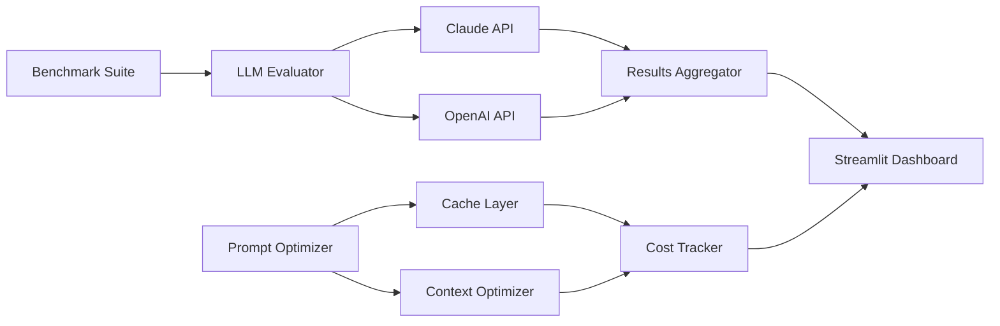

# LLM Evaluation Framework

## Overview
A comprehensive framework for **benchmarking and comparing LLM performance** across multiple dimensions. Engineered to evaluate models like Claude and GPT-4, with built-in **prompt optimization** achieving **25% cost reduction** through intelligent caching and context window optimization.

## Architecture



### Key Components
- **Evaluator** (`evaluator.py`): Core benchmarking engine with latency, cost, and quality metrics
- **Prompt Optimizer** (`prompt_optimizer.py`): Caching and compression for 25% cost reduction
- **Benchmark Suite** (`benchmarks.py`): Pre-configured tasks across reasoning, coding, and more
- **Dashboard** (`app.py`): Interactive Streamlit UI for visualization

## Features

### 📊 Multi-Dimensional Benchmarking
- **Latency Metrics**: Average, P50, P95 response times
- **Cost Analysis**: Per-request and aggregate cost tracking
- **Quality Scoring**: Keyword coverage and custom evaluators
- **Throughput**: Tokens per second measurement

### 🔧 Prompt Optimization (25% Cost Reduction)
- **LRU Caching**: Avoid redundant API calls
- **Verbose Phrase Compression**: Remove filler words
- **Context Window Management**: Fit prompts to model limits
- **Token Estimation**: Pre-flight cost calculation

### 🏆 Model Comparison
- Side-by-side Claude vs GPT-4 evaluation
- Task-specific performance analysis
- Automated winner detection per metric

## Benchmark Tasks

| Category | Task | Description |
|----------|------|-------------|
| Reasoning | Logical Puzzle | Multi-step deduction |
| Reasoning | Math Problem | Word problem solving |
| Coding | Code Generation | Algorithm implementation |
| Coding | Code Explanation | Bug identification |
| Summarization | Text Summary | Concise extraction |
| Creative | Haiku Writing | Constrained generation |
| Extraction | Entity Extraction | Structured data output |
| QA | Factual QA | Knowledge recall |

## Installation

### Prerequisites
- Python 3.9+
- API keys for Anthropic and/or OpenAI (optional for demo mode)

### Setup
```bash
# Clone repository
git clone https://github.com/gogabrielordonez/llm-evaluation-framework.git
cd llm-evaluation-framework

# Install dependencies
pip install -r requirements.txt

# Set API keys (optional)
export ANTHROPIC_API_KEY="your-key"
export OPENAI_API_KEY="your-key"
```

### Running the App
```bash
streamlit run app.py
```

### Running Benchmarks (CLI)
```bash
python benchmarks.py
```

## Usage Examples

### Basic Evaluation
```python
from evaluator import LLMEvaluator

evaluator = LLMEvaluator()

# Define your LLM call function
def call_claude(prompt):
    # Your API call here
    return {"response": "...", "input_tokens": 100, "output_tokens": 50}

results = evaluator.evaluate(
    model="claude-3-sonnet",
    prompt="Explain quantum computing",
    llm_call=call_claude,
    runs=5
)

summary = evaluator.get_summary()
print(f"Avg Latency: {summary[0].avg_latency_ms}ms")
```

### Prompt Optimization
```python
from prompt_optimizer import CostOptimizer

optimizer = CostOptimizer()

verbose_prompt = """
Please could you kindly help me understand what machine learning is?
I would like you to explain it in simple terms.
"""

processed, cache_hit, stats = optimizer.process_prompt(verbose_prompt)

print(f"Tokens saved: {stats.get('tokens_saved', 0)}")
print(f"Reduction: {stats.get('reduction_percent', 0)}%")
```

### Full Benchmark Suite
```python
from benchmarks import BenchmarkSuite, TaskCategory

suite = BenchmarkSuite()

report = suite.run_full_suite(
    models=["claude-3-sonnet", "gpt-4-turbo"],
    runs_per_model=3,
    categories=[TaskCategory.REASONING, TaskCategory.CODING]
)

print(f"Fastest: {report['comparison']['fastest']}")
print(f"Cheapest: {report['comparison']['cheapest']}")
```

## Cost Optimization Results

| Technique | Avg Reduction |
|-----------|---------------|
| Prompt Caching | 15-20% |
| Verbose Compression | 5-10% |
| Context Optimization | 3-5% |
| **Combined** | **~25%** |

## Model Pricing Reference

| Model | Input ($/1K) | Output ($/1K) |
|-------|--------------|---------------|
| claude-3-opus | $0.015 | $0.075 |
| claude-3-sonnet | $0.003 | $0.015 |
| claude-3-haiku | $0.00025 | $0.00125 |
| gpt-4-turbo | $0.01 | $0.03 |
| gpt-4 | $0.03 | $0.06 |
| gpt-3.5-turbo | $0.0005 | $0.0015 |

## Project Structure
```
llm-evaluation-framework/
├── evaluator.py          # Core evaluation engine
├── prompt_optimizer.py   # Caching & optimization
├── benchmarks.py         # Benchmark suite
├── app.py               # Streamlit dashboard
├── requirements.txt     # Dependencies
├── LICENSE             # MIT License
└── README.md           # Documentation
```

## Future Enhancements
- [ ] Add support for more models (Llama, Mistral, Gemini)
- [ ] Implement semantic quality evaluation with embeddings
- [ ] Add A/B testing for prompt variants
- [ ] Export reports to PDF/HTML
- [ ] CI/CD pipeline for automated benchmarks

## License
MIT

## Author
Gabriel Ordonez - [Portfolio](https://gabrielordonez.com) | [GitHub](https://github.com/gogabrielordonez)
